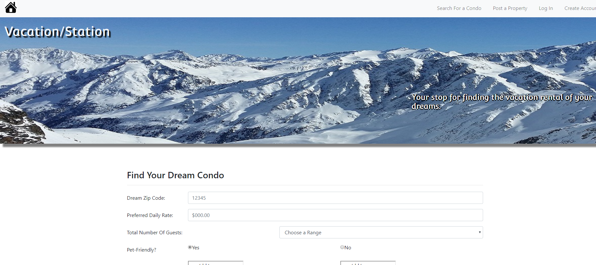

# Vacation-Station

### Overview

This app lets you post and brows available rental properties. We've used Sequelize, Amazon AWS, MySQL, Node, Express and other technologies. We are following the MVC design pattern; using Node and sequelize to query and route the data in the app, and routing to generate the HTML.

-----------------------------------------
#### March 2018 

-----------------------------------------

Current Version 1.0

---

* Vacation-Station lets you browse available properties to rent by price, location and # of guests.

* You can post your property to the site with a picture that is stored on Amazon AWS S3.

* Acounts can be created and stored in the JawsDB.

* [Check out this web site to see it in action!](https://vacation-station.herokuapp.com/.

---

## Screenshots

<table>
    <tr>
        <td>
            
        </td>
    </tr>
</table>

## How you can help

* Please let us know if you find any errors or if you have ways to achieve better efficiency.

-----------------------------------------

### How does the app work?

1. The app uses the express node app to serve the pages.

2. The routing is done in javascript using the express module, MVC and javascript.

3. The app is hosted on heroku.

3. Data is stored and pulled from JAWSDB and Amazon AWS S3.

## Dependencies
    
    "aws-sdk": "^2.202.0",
    "bcrypt-nodejs": "0.0.3",
    "body-parser": "^1.18.2",
    "connect-flash": "^0.1.1",
    "cookie-parser": "^1.4.3",
    "dotenv": "^5.0.0",
    "ejs": "^2.5.7",
    "express": "^4.16.2",
    "express-handlebars": "^3.0.0",
    "express-session": "^1.15.6",
    "method-override": "^2.3.10",
    "morgan": "^1.9.0",
    "multer": "^1.3.0",
    "mysql": "^2.15.0",
    "mysql2": "^1.5.2",
    "passport": "^0.4.0",
    "passport-local": "^1.0.0",
    "sequelize": "^4.33.4"

## History

This project was created as a group project on 03-01-18 for the University of Richmond Programming Bootcamp.

## License

This project is in the public domain within the United States, and
copyright and related rights in the work worldwide are waived through
the [CC0 1.0 Universal public domain dedication](https://creativecommons.org/publicdomain/zero/1.0/).# group2-project2